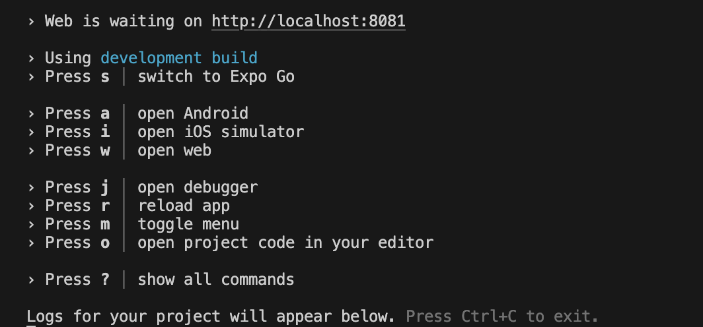
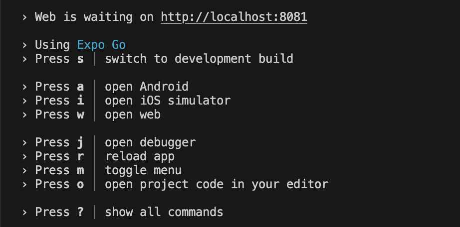
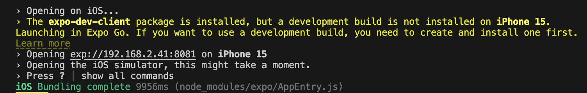
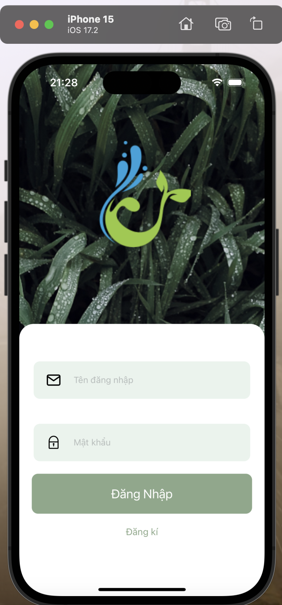
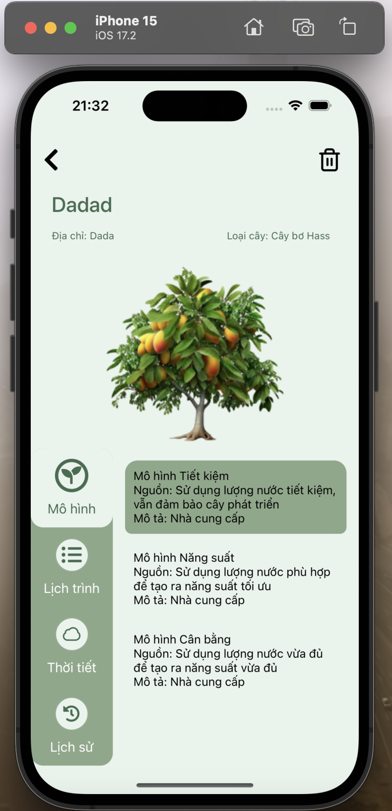

# App name
- Watamatic
- Farmatic
## Login Info
```
Username: sample.user
Password: bkhpcc
```
## Setup
To use this repository, you should have the Expo CLI installed on your system. You can install it globally using npm:
```
npm install -g expo-cli
```
To create a new project using this template, please clone this repository. Then run:
```
yarn install
```
## Run App
To run this project use this command:
```
npm start
```


Press `s` to switch to Expo Go:



Finally, press any key in the list to chose the platform need to be run.\
For example (iOS):



## Result

<table>
  <tr>
    <td></td>
    <td></td>
    <td></td>
  </tr>
</table>